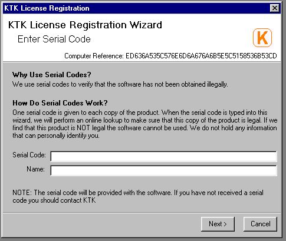



## Software Activation using the Internet

### Description

Have you ever wanted an easy-to-use method of product activation over the Internet? Well, here is one. A serial number generator is included.

You only need to upload one file onto your webserver called writeFile.php You only need PHP. MYSQL is not required.

I have downloaded some code from others and included it here but I cannot remember who the authors are...sorry.

I have used this method (but with a different mathematical algorithm) on my new program which I am hopefully going to sell. I will post snippets of my new program (KTK File Explorer) in the future.
 
### More Info
 
serial number

name

first of all before you start using this you must upload writeFile.php onto your webserver with PHP support (i used www.lycos.co.uk). Then in the folder you upload writeFile.php you must create a new folder and rename it to the productID. In the form you must change productid at the top to this value.

             |
---                |---
**Submitted On**   |2004-08-08 18:05:28
**By**             |[Andrew Roberts](https://github.com/Planet-Source-Code/PSCIndex/blob/master/ByAuthor/andrew-roberts.md)
**Level**          |Intermediate
**User Rating**    |5.0 (15 globes from 3 users)
**Compatibility**  |VB 6\.0
**Category**       |[Internet/ HTML](https://github.com/Planet-Source-Code/PSCIndex/blob/master/ByCategory/internet-html__1-34.md)
**World**          |[Visual Basic](https://github.com/Planet-Source-Code/PSCIndex/blob/master/ByWorld/visual-basic.md)
**Archive File**   |[Software\_A178003892004\.zip](https://github.com/Planet-Source-Code/andrew-roberts-software-activation-using-the-internet__1-55464/archive/master.zip)

